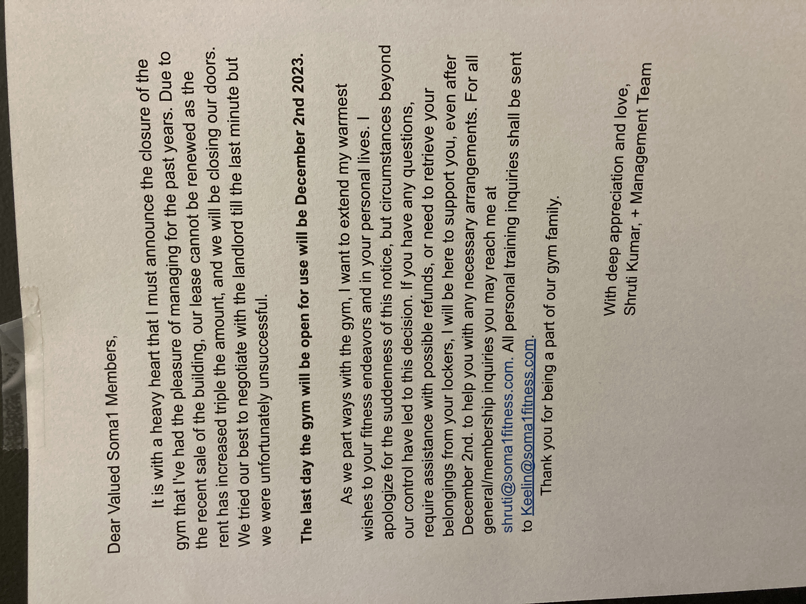

# Goodbye Soma 1 Gym in South Williamsburg, or No More Schvitzin with the Boys

> 

The writing had been on the wall for a long time, but this Friday it was literally on the wall.

## On Broadway Ave in South Williamsburg

Back in October I spent 2 full days on the phone with the gas company. Ultimately, I made some good friends. Miss you, Dominick.

Anyways, as I was getting ready to hang up and call back to find a different person who might be willing to listen and help, the guy who I could tell I was speaking to me from deep in Jewish Brooklyn and whom knew that my current location was not New York City paused and asked if he could tell me something.

"Of course", I replied, not skipping a beat.

"You know what? I'm jealous you're in REDACTED_PLACE. New York is really going downhill."

"I like the downhill, I replied. It's easier to bike."

Maybe my man at National Grid has a point.

## A Schvitz on Every Block

> 
>
> --- https://groups.jewishgen.org/g/main/topic/the_yiddish_word_schvitz/70414493?p=

## Gyms and Health as a Communal Space

## Making Friends in the Sauna

## Honoring the Loss of Community Space as Neighborhoods Change

## The Last Day of Soma Fitness
